# Social Network API

## Description

- My motivation is to create a API system that can use CRUD for an API of users with thoughts, friends, and reactions.
- I build this project to expand the social network platforms.
- It solves the problem of having to use API to construct a basic social network platform.
- I learned that MONGODB has id that are hard to identify than MySQL.

## Table of Contents

If your README is long, add a table of contents to make it easy for users to find what they need.

- [Installation](#installation)
- [Usage](#usage)
- [Credits](#credits)
- [License](#license)
- [Badges](#badges)
- [Features](#features)
- [HowToContribute](#how-to-contribute)
- [Tests](#tests)

## Installation

Download the zip or clone the GitHub repo. Open VS code. Open the integrated terminal and type in `Node index.js`. Run Insomnia to test the API system with CRUD.

## Usage

GitHub Repo: https://github.com/Jasony95/social-network-api

Video Demonstration: https://drive.google.com/file/d/14YR4joe1nK-qnJjlYaDVwaH6G1z4pCxZ/view

Get All Users
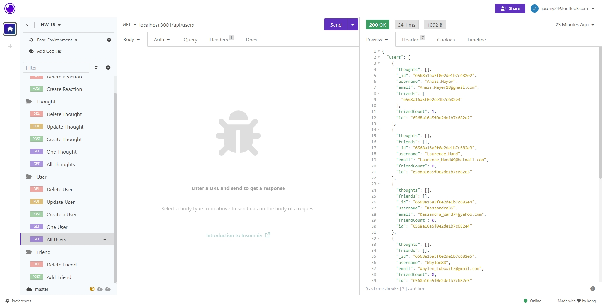
Get One User
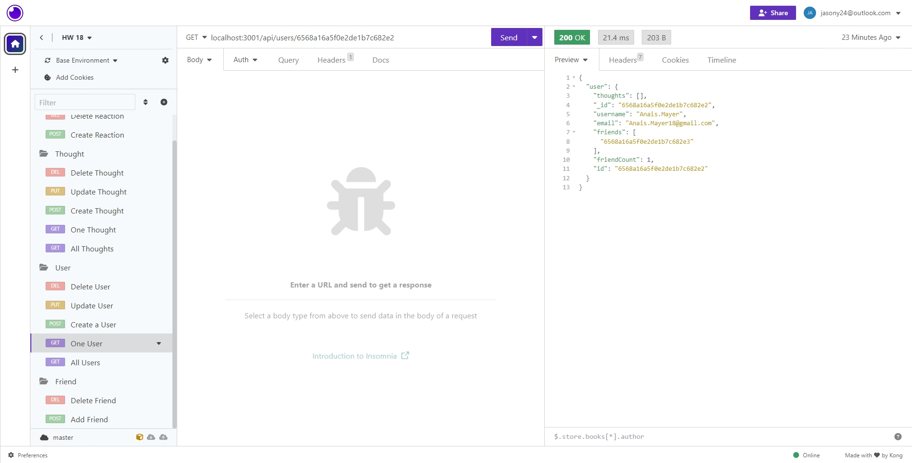
Create a User
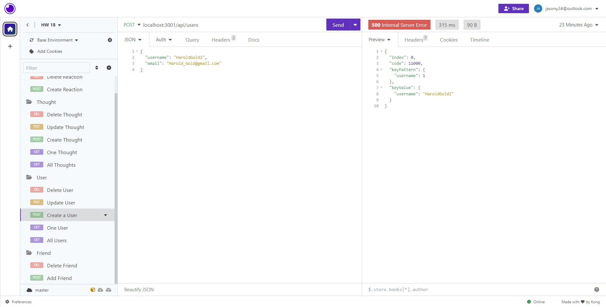
Update a User
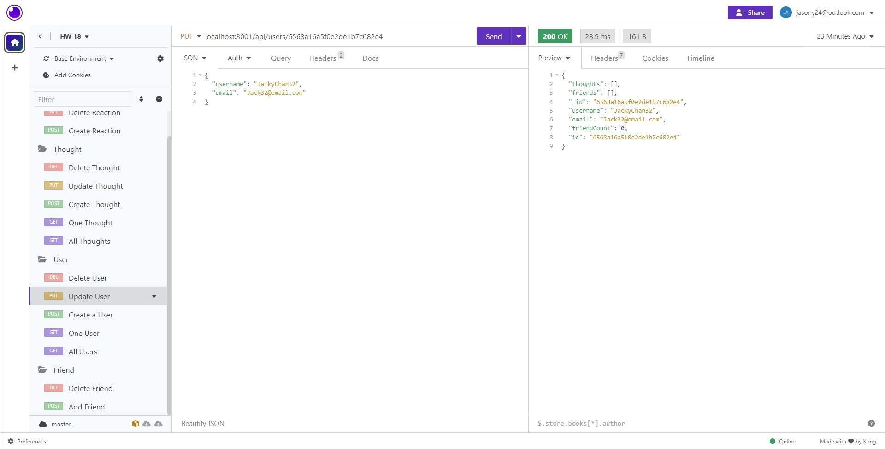
Delete a User
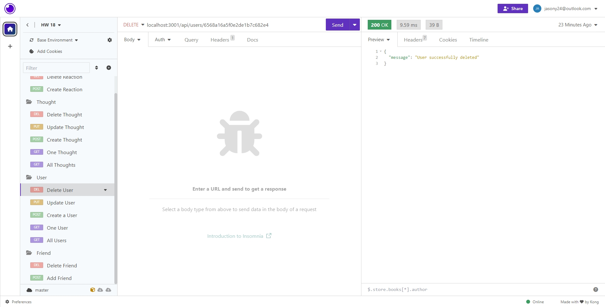
Add a Friend
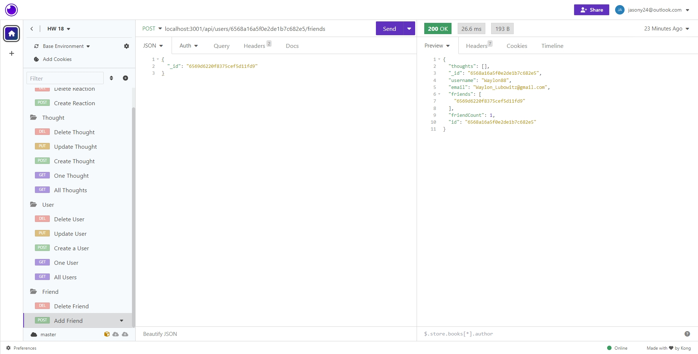
Delete a Friend
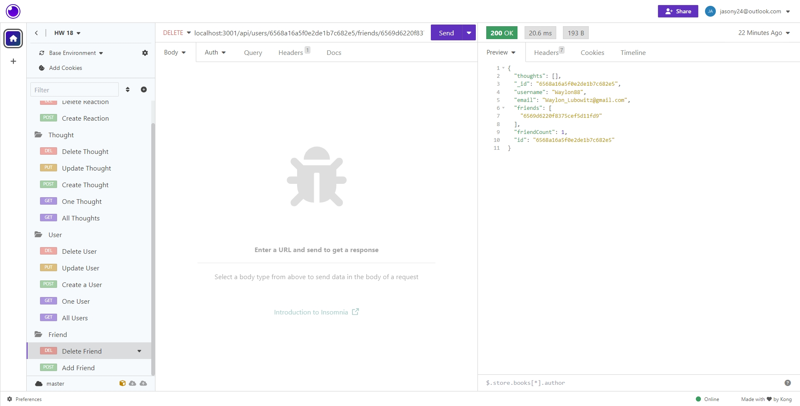
Get All Thoughts
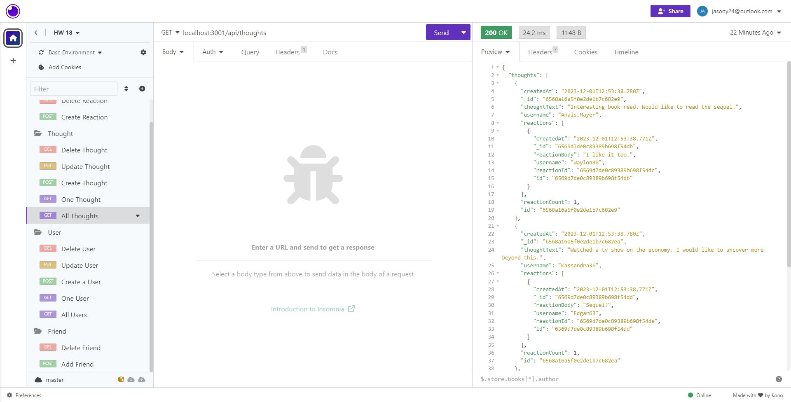
Get One Thought
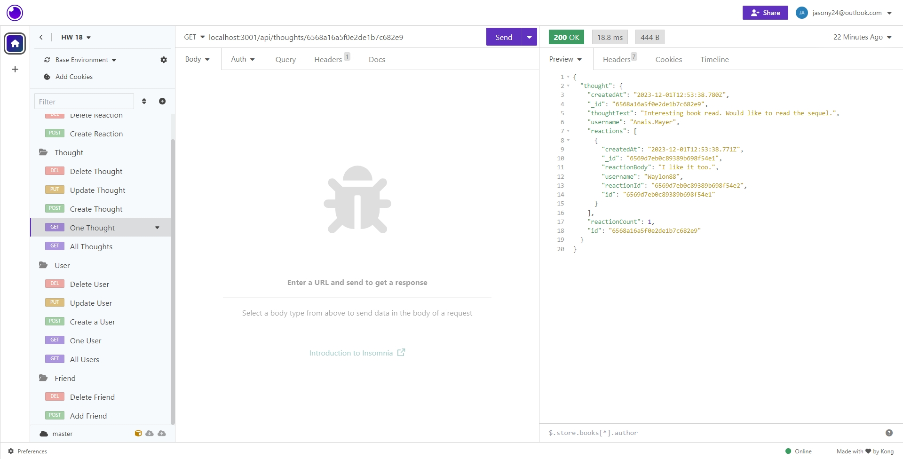
Create a Thought
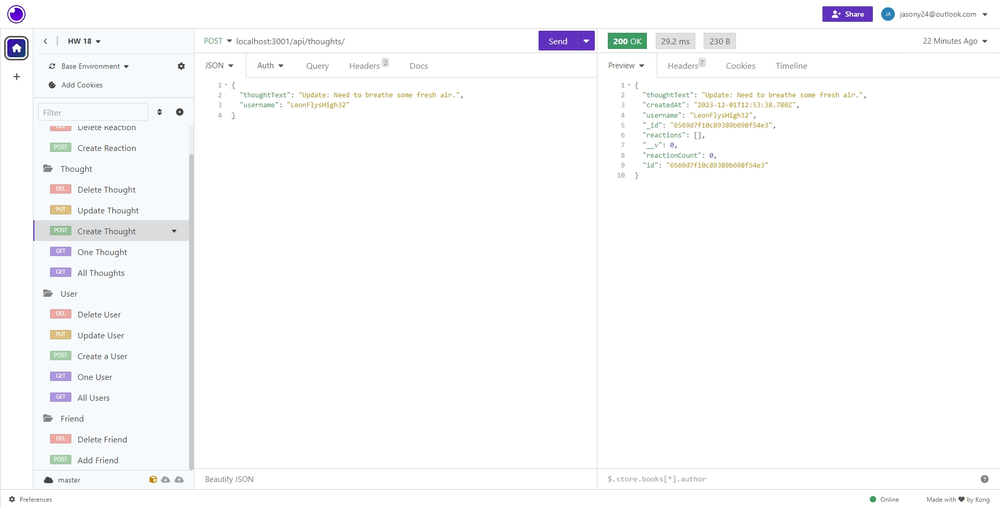
Update a Thought
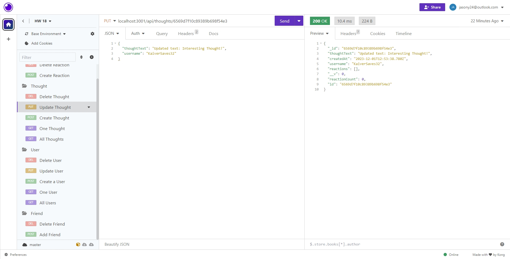
Delete a Thought
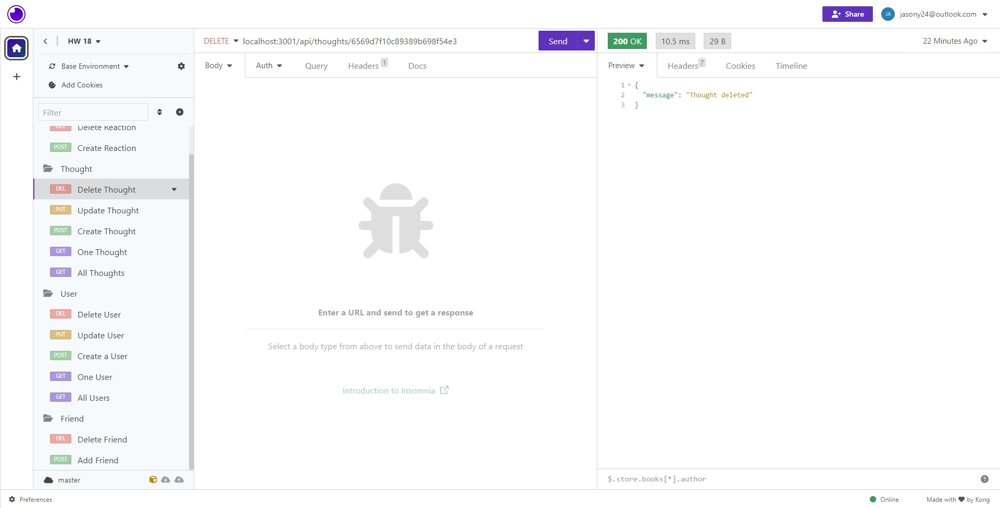
Create a Reaction
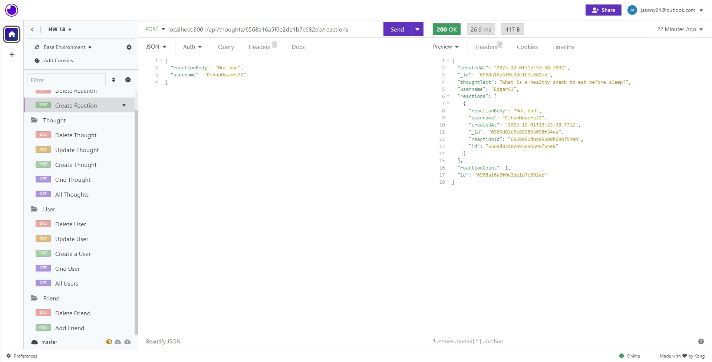
Delete a Reaction
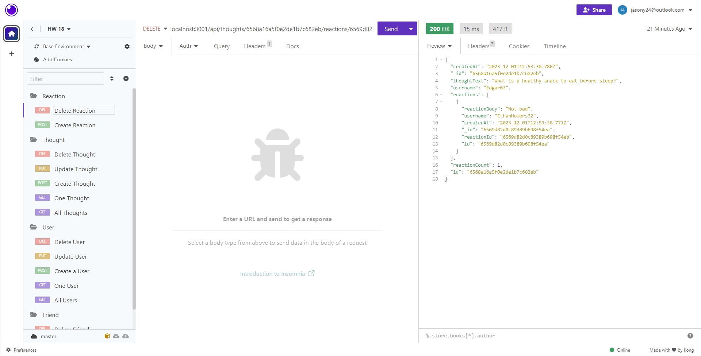

## Credits

Collaborators:

1. Sichoun Nplhaib Lee: https://github.com/DDXP3
2. Joey Thao: https://github.com/Thaodev23

Sources:

1. https://mongoosejs.com/docs/schematypes.html
2. https://stackoverflow.com/questions/18022365/mongoose-validate-email-syntax
3. https://stackoverflow.com/questions/22405975/how-to-validate-string-length-with-mongoose
4. https://stackoverflow.com/questions/70724966/how-to-use-getter-or-setter-with-mongoose-timestamps
5. https://stackoverflow.com/questions/27465850/typeerror-router-use-requires-middleware-function-but-got-a-object

## License

No License used.

## Badges

No badges used.

## Features

API where CRUD is implemented. Also, a basic social network platform.

## How to Contribute

No Contribution needed.

## Tests

No testing needed.